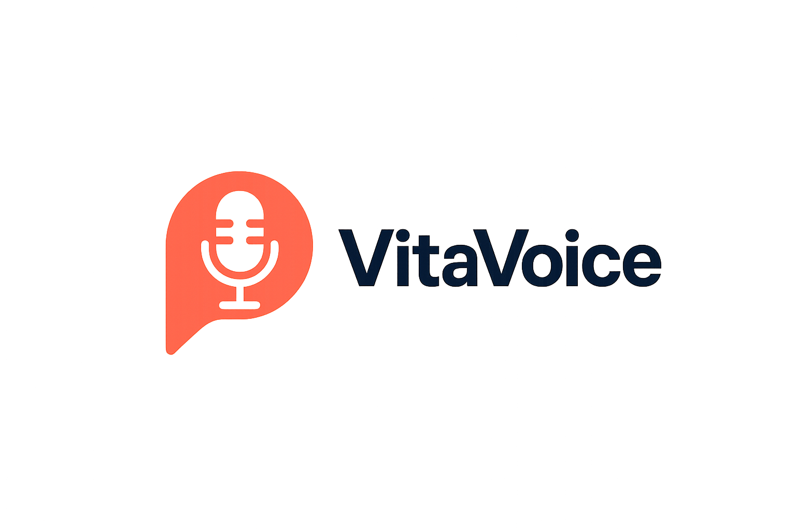

<p align="center">
  
</p>

<h1 align="center">VitaVoice</h1>
<p align="center"><i>Your Voice, Your Health</i></p>

---

<p align="center">
  <b>Demo Video</b><br>
  <video width="480" controls>
    <source src="assets/vitavoice_video.mp4" type="video/mp4">
    Your browser does not support the video tag.
  </video>
</p>


---

##  Overview

**VitaVoice** is an AI-powered healthcare assistant that enables seamless, multilingual voice and text conversations between patients and an AI doctor. Leveraging advanced Speech-to-Text (STT), **Murf AI Text-to-Speech (TTS), Streaming**, **MurfAI Translation**, and Large Language Model (LLM) technologies, VitaVoice delivers accessible, secure, and intelligent healthcare interactions—anytime, anywhere.

---

##  Key Features

- **Conversational AI Doctor (Voice & Text):**  
  Speak or type your health concerns. VitaVoice transcribes your speech, understands your needs, and responds with natural, AI-generated voice or text.

- **Automatic EHR Generation:**  
  Instantly generate and download structured Electronic Health Records (EHR) from your chat history—perfect for sharing with real doctors.

- **Multilingual, Real-Time Translation:**  
  Converse in your preferred language. VitaVoice translates both your queries and the AI's responses, and delivers them as clear, natural-sounding speech.

- **Murf AI TTS & Translation:**  
  VitaVoice integrates with Murf AI for high-quality, natural Text-to-Speech (TTS) and supports real-time translation, enabling users to hear responses in their chosen language and voice.

- **Streaming Audio Features:**  
  Experience low-latency, real-time audio streaming for both input and output. Audio is processed and played back instantly, making conversations feel natural and interactive.

- **Doctor Recommendation & Appointment Booking:**  
  Get personalized doctor recommendations based on your chat history and book appointments with real specialists.

- **Secure & Private:**  
  All data is encrypted and securely stored. Your privacy is our top priority.

- **Downloadable Health Records:**  
  Access and download your chat history and EHR summaries at any time.

---

##  Architecture

```mermaid
flowchart TD
    A[User (Web/Voice)] -->|Voice/Text| B[Streamlit Frontend]
    B -->|Audio| C[Speech-to-Text (STT)]
    C -->|Text| D[AI Chat Engine (LLM)]
    D -->|Text| E[Murf AI TTS & Translation]
    D -->|Text| F[EHR Generator]
    E -->|Streaming Audio| B
    F -->|EHR PDF| B
    B -->|API| G[MongoDB (User, Doctor, Chat, EHR)]
```

---

##  Getting Started

### 1. Clone the repository

```bash
git clone https://github.com/neelamnagarajgithub/vitavoice.git
cd vitavoice/streamlit-app
```

### 2. Create and activate a virtual environment

```bash
python3 -m venv venv
source venv/bin/activate
```

### 3. Install dependencies

```bash
pip install -r requirements.txt
```

### 4. Set up environment variables

Create a `.env` file in the root directory and add:

```
MONGO_URI=your_mongodb_connection_string
OPEN_ROUTER_KEY=your_openrouter_api_key
MURF_API_KEY=your_murf_api_key
ELEVENLABS_API_KEY=your_elevenlabs_api_key
BASE_URL=http://localhost:8501
```

### 5. Add your logo

Place your logo at `assets/logo.png`.

### 6. Run the application

```bash
streamlit run src/main.py
```

---

##  Folder Structure

```
streamlit-app/
├── assets/
│   └── logo.png
├── src/
│   ├── pages/
│   │   ├── home.py
│   │   ├── dashboard.py
│   │   ├── consult_doctor.py
│   │   └── appointment.py
│   ├── services/
│   │   ├── auth.py
│   │   ├── engine.py
│   │   ├── murfservice.py
│   │   └── whisper_stt.py
│   └── main.py
├── requirements.txt
└── .env
```

---

## Contributing

Pull requests are welcome! For major changes, please open an issue first to discuss what you would like to change.  
We welcome contributions in UI/UX, backend, AI/NLP, and documentation.

---

##  License

[MIT](LICENSE)

---

## Developed By
- [Nagaraj Neelam](https://github.com/neelamnagarajgithub)
- [Shatakshi Palli](https://github.com/ShatakshiPalli)

##  Contact

- Email: neelamnagaraj99@gmail.com
- website: [vitavoice.streamlit.app](vitavoice.streamlit.app)

---

<p align="center">
  <b>Let's revolutionize healthcare together with AI-powered voice solutions!</b>
</p>